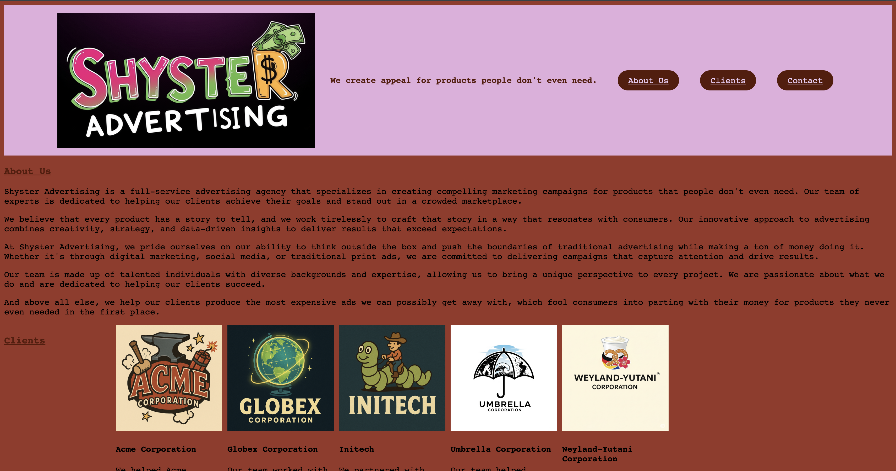

# Business Splash Page

  ## License
  
  
  [MIT License](https://opensource.org/licenses/MIT)

  ## Contents
  ---------

  - [License](#license)
  - [Description](#description)
  - [Installation](#installation)
  - [Contribution](#contribution)
  - [Questions](#questions)

  ## Description

  A simple splash page for a fictional business. Using HTML, CSS, and Javascript I have designed a very barebones webpage to illustrate my understanding of coding concepets for the languages mentioned above.

  ## Installation

  First you will need to clone the repository

  `` git clone git@github.com:bjaegerthomas/Technical-Assessment.git ``

  Navigate to the Module 1 folder. From here you can view the webpage by right clicking on the index.html file in VS Code and selecting "open in default browser."

  I've included a screenshot here:

  

  ## Contribution

  After cloning the repository be sure to create a new branch for your feature or fix.
  Make your changes and commit them with descriptive messages.
  Submit a Pull Request with clear explanations of your modifications.
  Use meaningful variable names and comments.
  Follow guidelines for HTML, CSS, and Javascript formatting.

  ## Questions

  - GitHub: [bjaegerthomas](https://github.com/bjaegerthomas)
  - Email: bjaegerthomas@gmail.com