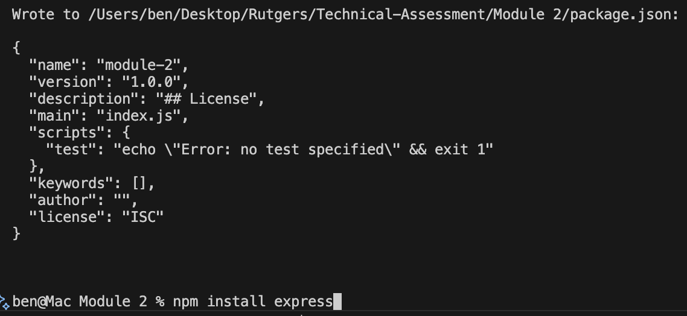
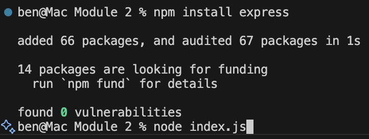
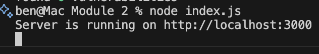
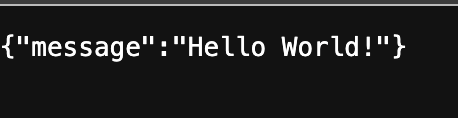

# "Hello World!" Restful API

  ## License
  
  
  [MIT License](https://opensource.org/licenses/MIT)

  ## Contents
  ---------

  - [License](#license)
  - [Description](#description)
  - [Installation](#installation)
  - [Contribution](#contribution)
  - [Questions](#questions)

  ## Description

  A node server using express to create a simple "Hello World!" restful API which resturns a json object.

  ## Installation

  First you will need to clone the repository

  `` git clone git@github.com:bjaegerthomas/Technical-Assessment.git ``

  In vscode you will want to navigate to the Module 2 folder.

  Open an integrated terminal in VS Code from the 2nd module folder.

  Next you will type  `` npm init -y ``. 

  and then you will need to install express `` npm install express ``. 

  Once this is complete you will type the following into the terminal: `` node index.js `` and hit return. 

  Right click or cmd + left click on the port link which comes up and is running locally. 

  Once you do this a page should open in your default browser displaying the following image:

  

  ## Contribution

  After cloning the repository be sure to create a new branch for your feature or fix.
  Make your changes and commit them with descriptive messages.
  Submit a Pull Request with clear explanations of your modifications.
  Use meaningful variable names and comments.
  Follow guidelines for Javascript formatting.

  ## Questions

  - GitHub: [bjaegerthomas](https://github.com/bjaegerthomas)
  - Email: bjaegerthomas@gmail.com